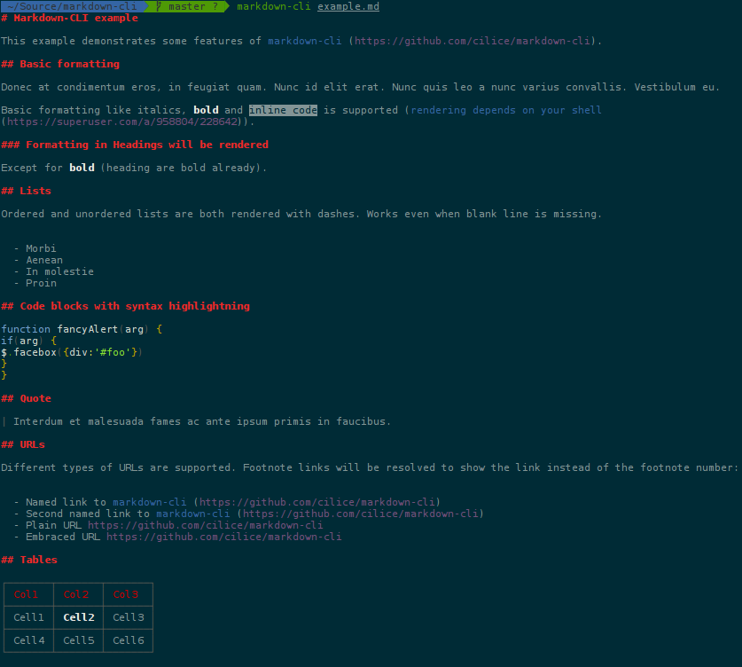

# markdown-cli [](https://travis-ci.org/cilice/markdown-cli)

Output markdown to CLI

## Screenshot

See an [example.md](example.md) rendered:



## Installation

Download node at [nodejs.org](http://nodejs.org) and install it, if you haven't already.

```sh
npm install markdown-cli --global
```


## Tests

```sh
npm install
npm test
```

## Dependencies

- [cardinal](https://github.com/thlorenz/cardinal): Syntax highlights JavaScript code with ANSI colors to be printed to the terminal.
- [chalk](https://github.com/chalk/chalk): Terminal string styling done right. Much color.
- [cli-table](https://github.com/Automattic/cli-table): Pretty unicode tables for the CLI
- [get-stdin](https://github.com/sindresorhus/get-stdin): Get stdin as a string or buffer
- [indent-string](https://github.com/sindresorhus/indent-string): Indent each line in a string
- [marked](https://github.com/chjj/marked): A markdown parser built for speed
- [meow](https://github.com/sindresorhus/meow): CLI app helper
- [node-emoji](https://github.com/omnidan/node-emoji): simple emoji support for node.js projects
- [update-notifier](https://github.com/yeoman/update-notifier): Update notifications for your CLI app
- [wrap-ansi](https://github.com/chalk/wrap-ansi): Wordwrap a string with ANSI escape codes

## Dev Dependencies

- [ava](https://github.com/sindresorhus/ava): Simple concurrent test runner
- [xo](https://github.com/sindresorhus/xo): JavaScript happiness style ❤️ XOXO


## License

MIT
